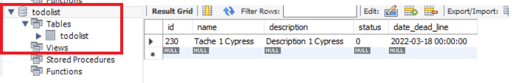

## Introduction

Projet "To do list" qui permet de gérer une liste de taches et enregistrer ces taches dans une base de donnée Mysql.

## Modules necessaires

- nodemon (globalement)
- express
- mysql
- cypress
- et cors

## Créer une base de données sous Mysql

Créer une base de donnée 'todolist' et y mettre la table:

> CREATE TABLE todolist (
>     id int NOT NULL AUTO_INCREMENT,
>     name VARCHAR(250),
>     description VARCHAR(250),
>     status CHAR(50),
>	  date_dead_line DATETIME,
>     PRIMARY KEY (id)
>     );

## Utilisation

- Lancer npm install
- puis nodemon app.js (ou Node app.js)

L'application "todoList" apparraitra à l'url localhost:3000/

Pour l'application React, il faudra utiliser localhost:3000/react.html

## Lancer les tests

- Node ./static/templateSSR/formTest.js
- Node ./static/templateSSR/tableTest.js

## Lancer le test cypress

- Lancer nodemon app.js (ou Node app.js), 
- puis ouvrir un autre terminal et taper: npx cypress open